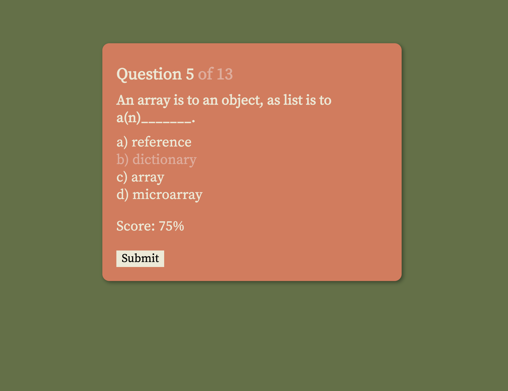
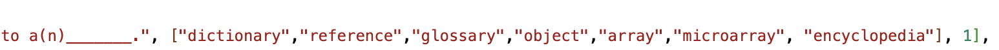

# 2023-quiz-game
<h1 align="center">A simple python quiz game</h1>

 

This is a simple quiz game I created using HTML, CSS, and vanilla JavaScript in two days. This project was completed to show proof of understanding of the model-view-controller framework of web development. 
  
The current version comes preloaded with a few python related questions that I created. The reason for choosing these questions is because of my constant confusion between javascript and python terminology and concepts.  
  
In the source file, there are also two other question libraries that are related to (1) TV shows, and (2) India. 

<h2>About</h2>

<h2>The Gameplay</h2>
The gameplay is simple.  A user can select and click through the questions. 
  
For each multiple-choice question, the displayed answers are customizable. The quiz bank can be edited to include as many false answers as desired. 

 

In the library array, each question (herein, referred to as 'Q'), has the following template: 
`[[question],[correctAnswer, incorrectAnswer, incorrectAnswer, . . . ], int]` 
where: 
1) position [0] is the question, 
2) position [1] are the multiple choice answers, and 
3) position [2] is a number that indicates an exception. 
 
Generally, position Q[1][0] contains the correct answer, and all following indices (e.g. Q[1][1]. Q[1][2]. Q[1][3]. Q[1][4], Q[1][5]... etc.) contain incorrect answers.  
  
The reason I made it possible a multitude of false answers, was to make the game more interesting. Someone creating a new quiz with this program could optimize the false answers so that the questions can be easier or more difficult.  
  
Question lists are also randomized, so that each time this game is played, the order of the questions are scrambled. 
  
Another important aspect was to include an exception parameter, indicated by position Q[2]. 
In this current version of the game, Q[2] = 1 indicates that a single answer at position Q[0] is the correct answer, while Q[2] = 0 indicates that all answers are acceptable. 
  
Proceeding versions of this game can include other options for this parameter (for example: Q[2] = 2 -> two answers are acceptable,Q[2] = 3 -> three answers are acceptable, etc.)  

<h2>The Process</h2>

Initial mockups were created quickly in Adobe illustrator.  

 

I wanted to create a simple interface for selecting and submitting answers. 
  
I chose a simple, type-writer-esque font (Source Serif Pro) from <a href="https://fonts.google.com/specimen/Source+Serif+Pro?query=source+serif">Google Fonts</a>. The colors were generated through <a href="https://colorhunt.co/palette/ede9d5e7ab9adf7857617143">colorhunt, here</a>.  

<h2>Next Steps</h2>

Subsequent versions will include ways to select from a set of questions (i.e. different quiz banks). It is my hope to include slightly technical or slightly esoteric questions in these additional versions. 
It is also my hope to be able to recall previous progress by reading from local storage, so that users can come back to a question set.  

